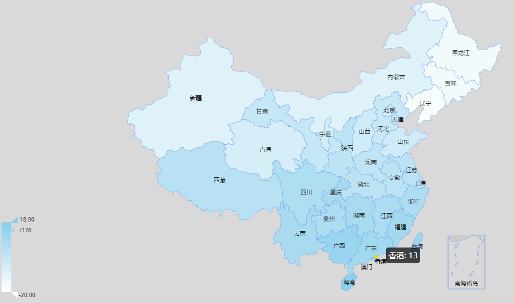
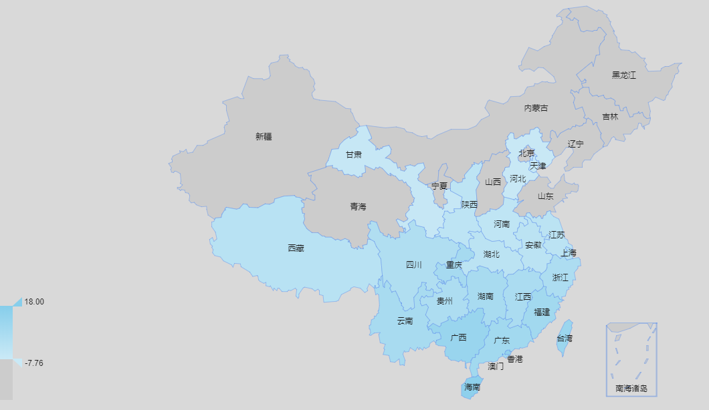
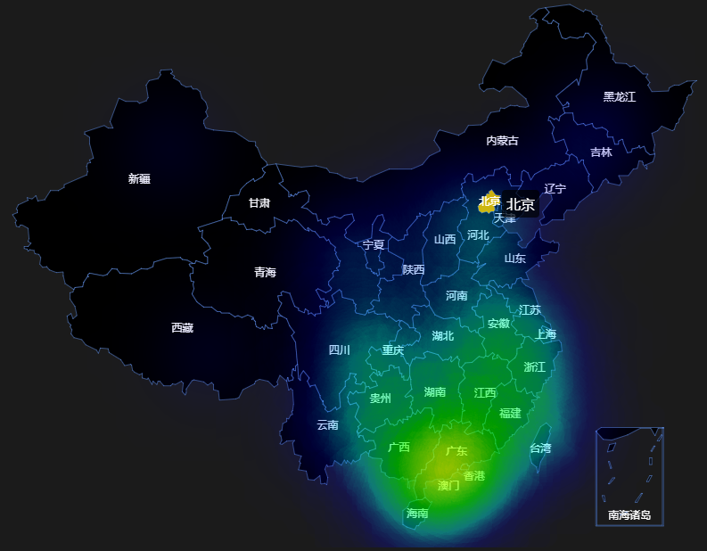
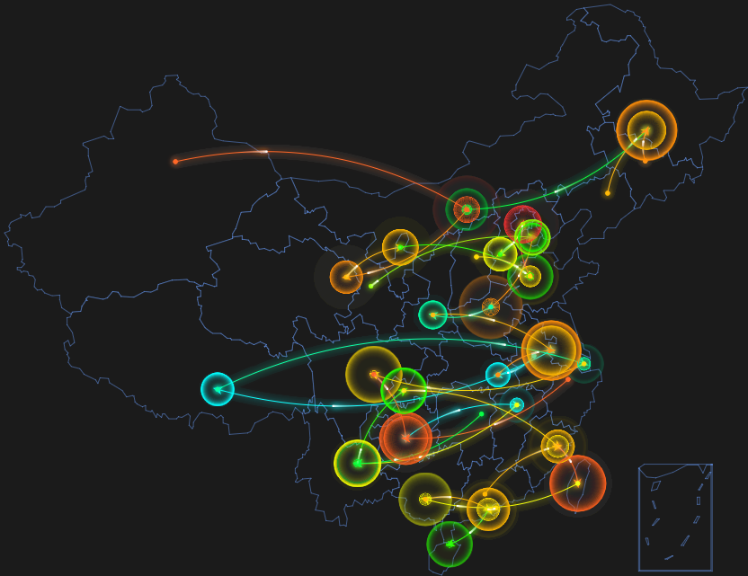

# Node.js + R 气温地图可视化
## Node.js数据采集和处理
	$ npm install
	$ node index.js -参数
	$ node index.js -T // 执行所有可视化数据生成
	$ node index.js -h // 查看帮助，如下

 Usage: index [options]

 Options:

- -V, --version               
	* Output the version number
- -T, --temperature           
	* Get Temperature From Apis and Transform it into Heat
- -L, --local_transformation  
	* Transform the local temperature data to heat data
- -P, --provinces             
	* Display all the provinces that can get info of weather
- -h, --help                  
	* Output usage information

### R环境下需要先安装库 REmap、maps、mapdata、maptools、rgeos(可选)
## R数据可视化	
	$ RScript Tmap_Visualization.R 绘制温度图
	$ RScript Heatmap_Visualization.R 绘制热力图
	$ RScript Sortmap_Visualization.R 绘制类迁徙温度排序地图

# 技术开发说明
## Node.js 代码结构 
### Controller.js 
* 通过API获取全国天气情况
* 把获取的天气情况按(省+气温)写入t.csv文件中
* 调用local_transform.js接口，控制生成热力图绘制数据和类迁徙温度地图绘制数据
### api.js
* 天气API接口，处理网络通讯获取天气数据过程(包括签名验证过程)
### local_transform.js
* 根据已获取的天气数据(本地可修改)t.csv的(省+气温)数据:
* 输出一个heat.csv(经度+纬度+热密度(气温))用于绘制热力图
* 按温度排名省份,并生成轨迹顺序图migrate.csv数据,用于绘制类迁徙温度地图

> 注意，**Controller文件里的UID和KEY可以修改为自身申请的**以确保程序正常获取数据而不会超出测试限制次数，点击此处[天气API账号密钥申请](https://www.seniverse.com)

## R Script说明
### 调用REmap读取csv文件进行绘图，参数调整详见R代码

## 开发思路(思维导图)
